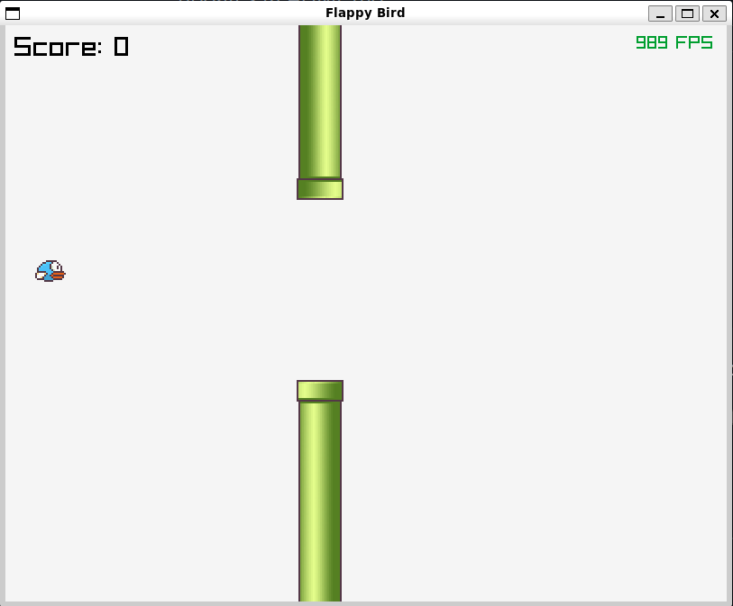

# raylib-flappy-bird-clone

Compile with:

```bash
gcc -o main main.c -std=c99 -Wall -I/usr/local/include/ -L/usr/local/lib/libraylib.a -lraylib -lGL -lm -lpthread -ldl -lrt -lX11
```

Sprites taken from https://github.com/samuelcust/flappy-bird-assets

## Example


